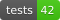

## Better Code, Better Science

[Better Code, Better Science](https://bettercodebetterscience.github.io/book/) is an open-source book on building better code for science using AI.  

Author: [Russ Poldrack](http://poldrack.github.io)

This repo contains the Python module and notebooks used for examples in the book, as well as the web version of the book.

The book is licensed according to the [Creative Commons Attribution-NonCommercial-NoDerivatives 4.0 Generic (CC BY-NC 4.0) License](https://creativecommons.org/licenses/by-nc-nd/4.0/). Please see the terms of that license for more details.  Code in this repo and code snippets in the book are licensed under the [MIT License](https://mit-license.org/).
