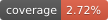

## Better Code, Better Science

https://doi.org/10.5281/zenodo.18603015

[Better Code, Better Science](https://bettercodebetterscience.github.io/book/) is an open-source book on building better code for science using AI.  

Author: [Russ Poldrack](http://poldrack.github.io)

This repo contains the Python module and notebooks used for examples in the book.

The code in this repo is licensed according to the MIT License.
